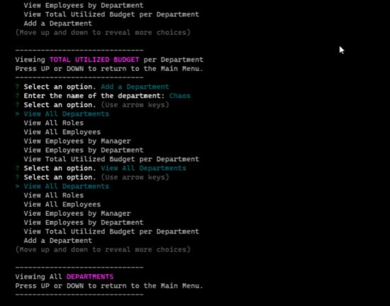

# Track Suit

## Description

Track Suit is a CLI Node.js application that connects to a local MySQL database which contains business infrastructure and employee data. The user of the CLI can view, add and delete departments, roles, and employees, as well as make modifications to employee data.

## Table of Contents

- [Installation](#installation)
- [Usage](#usage)
- [License](#license)
- [Contributing](#contributing)
- [Questions](#questions)

## Installation

Download the source files for the application with `git clone <src>`, then install all dependencies with `npm i`.

## Usage

In db/connection.js, change the password of the MySQL connection to whatever your local password is. From the MySQL shell, run `source db/db.sql`, then `source db/schema.sql` to create the database architecture. For sample data, run `source db/seeds.sql`. Run the app with `node app`.

For a video demonstration of this app, visit [here](https://watch.screencastify.com/v/6unqrXmYshJEoGBj01gd).

## License

[The MIT License](https://mit-license.org/)

Copyright © 2021 branjames117

Permission is hereby granted, free of charge, to any person obtaining a copy of this software and associated documentation files (the “Software”), to deal in the Software without restriction, including without limitation the rights to use, copy, modify, merge, publish, distribute, sublicense, and/or sell copies of the Software, and to permit persons to whom the Software is furnished to do so, subject to the following conditions:

The above copyright notice and this permission notice shall be included in all copies or substantial portions of the Software.

THE SOFTWARE IS PROVIDED “AS IS”, WITHOUT WARRANTY OF ANY KIND, EXPRESS OR IMPLIED, INCLUDING BUT NOT LIMITED TO THE WARRANTIES OF MERCHANTABILITY, FITNESS FOR A PARTICULAR PURPOSE AND NONINFRINGEMENT. IN NO EVENT SHALL THE AUTHORS OR COPYRIGHT HOLDERS BE LIABLE FOR ANY CLAIM, DAMAGES OR OTHER LIABILITY, WHETHER IN AN ACTION OF CONTRACT, TORT OR OTHERWISE, ARISING FROM, OUT OF OR IN CONNECTION WITH THE SOFTWARE OR THE USE OR OTHER DEALINGS IN THE SOFTWARE.

## Contributing

This repository and its contributors follow the [Contributor Covenant Code of Conduct](https://www.contributor-covenant.org/version/2/1/code_of_conduct/code_of_conduct.md).

## Questions

This repository was created and is maintained by [branjames117](https://github.com/branjames117).

With any questions email the repository owner at [branjames117@gmail.com](mailto:branjames117@gmail.com).
